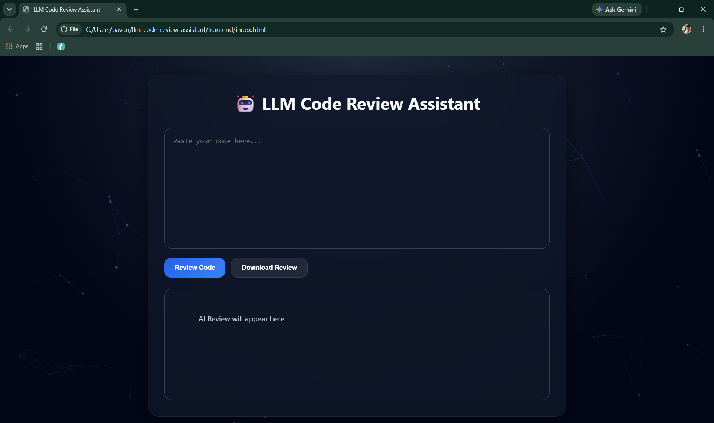
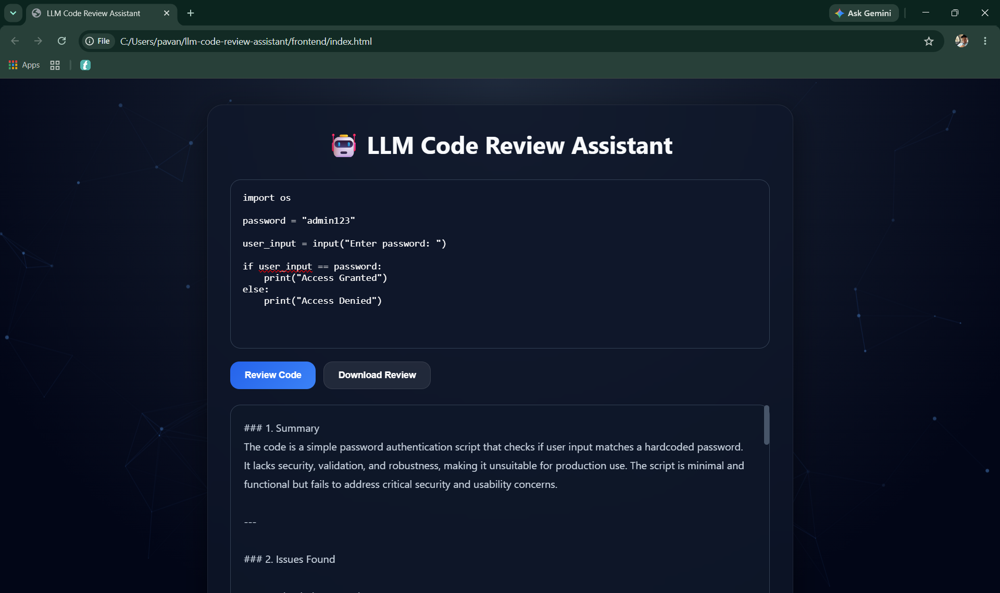

# 🤖 LLM Code Review Assistant

An AI-powered code review assistant built using FastAPI, Ollama, and Qwen 3B. The application analyzes source code and generates intelligent feedback including code summaries, issues, and improvement suggestions.

---

## 🚀 Features

- AI-powered code reviews using Qwen 3B
- FastAPI backend
- REST API integration
- Modern frontend UI
- Automatic issue detection
- Improvement recommendations
- Downloadable review reports
- Local LLM execution with Ollama

---

## 🛠️ Tech Stack

### Backend
- Python
- FastAPI
- Uvicorn
- Requests

### AI Model
- Ollama
- Qwen3:8B

### Frontend
- HTML
- CSS
- JavaScript

### Version Control
- Git
- GitHub

---

## 📂 Project Structure

```text
LLM-code-review-assistant/
│
├── backend/
│   ├── main.py
│   ├── reviewer.py
│
├── frontend/
│   ├── index.html
│   ├── style.css
│   ├── script.js
│
├── reports/
│
├── README.md
└── .gitignore
```

---

## ⚙️ Installation

### Clone Repository

```bash
git clone https://github.com/pavan19-06/LLM-code-review-assistant.git

cd LLM-code-review-assistant
```

### Install Dependencies

```bash
pip install fastapi uvicorn requests
```

### Install Ollama

Download Ollama:

https://ollama.com

Pull Qwen model:

```bash
ollama pull qwen3:8b
```

---

## ▶️ Run Backend

```bash
cd backend

uvicorn main:app --reload
```

Backend will run at:

```text
http://127.0.0.1:8000
```

Swagger API Documentation:

```text
http://127.0.0.1:8000/docs
```

---

## 🖥️ Run Frontend

Open:

```text
frontend/index.html
```

in your browser.

---

## 📸 Screenshots

### Home Interface

## 📸 Screenshots

### Home Interface



### Code Review Result



---

## 📖 Example Workflow

1. Paste source code into the input area.
2. Click Review Code.
3. Code is sent to FastAPI backend.
4. Backend forwards prompt to Qwen through Ollama.
5. AI generates:
   - Summary
   - Issues Found
   - Suggestions
6. Results displayed instantly on UI.

---

## 🎯 Future Improvements

- Multi-language support
- Syntax highlighting
- Severity scoring
- Authentication system
- Docker deployment
- Cloud-hosted API
- Export PDF reports

---

## 👨‍💻 Author

**Pavan R**

B.Tech Artificial Intelligence & Machine Learning

GitHub:
https://github.com/pavan19-06

---

## ⭐ Project Status

Completed as an academic AI/ML portfolio project demonstrating:

- FastAPI Development
- REST API Integration
- Local LLM Deployment
- Frontend Development
- Git & GitHub Workflow
- AI Application Development
